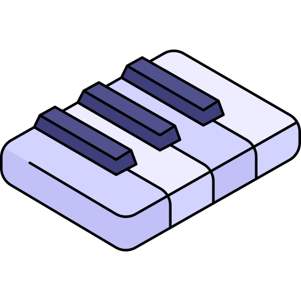

<h2 align="center">Hi There👋! I'm Shervin, Machine Learning and Artificial Intelligence Enthusiast.</h2>

###
- 🔭 I’m doing research on **Matching Energy of Graphs**

- 🌱 I’m currently learning **TensorFlow, Pytorch and MATLAB**

- 💡I'm Interested in Natural Language Processing and Computer Vision

- 📫 How to reach me **sherviniranaghideh@gmail.com**

- ⚡ Fun fact: **I'm a big Physics nerd and I love Classical music.**

###

  <!--

###

###
-->

  <h2>Skills:  <h2/>
  
  
  
  
  
  
  
  
  
  
  
  
  
  
  
  
  
  
  
  
  
  
  
  
  
  
  

###
<h3 align="left">Connect with me:</h3>

  
  
<!--    -->

###
<!--

-->
